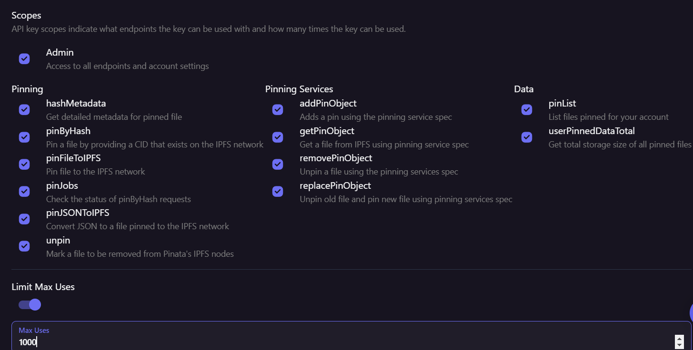

# Building and Deploying a Blockchain NFT Marketplace DApp

Enter the realm of digital ownership and creativity with our blockchain NFT (Non-Fungible Token) Marketplace DApp. This groundbreaking platform empowers creators and collectors to tokenize and trade unique digital assets securely and transparently on the blockchain.

Our NFT Marketplace DApp provides a decentralized marketplace where creators can mint, showcase, and sell their digital creations as NFTs. These NFTs represent ownership of digital assets, such as art, music, videos, virtual real estate, and more, with each token being one-of-a-kind and indivisible

## Instruction

Kindly follow the following Instructions to run the project in your system and install the necessary requirements

#### step1 Install Vs Code Editor

```https://code.visualstudio.com/download
  GET: VsCode Editor
```

#### step 2 check the NodeJs & NPM Version

we want eaxct same version mentioned below

```https://nodejs.org/en/download
  https://nodejs.org/en/blog/release/v18.20.1 download the node js
  NPM: 8.19.2:- enter the command to download the npm version in terminal npm install -g npm@8.19.2

```

### STEP 3 INSTALL NPM

COMMAND:- npm i

### step 4 create meta task account

### step 5 add new network

# step 6 add this configuration to new network 

#### step 7 deploy the hardhat

npx hardhat node

## step 8 copy the private key and add to meta mask wallet


click on add account or hardware wallet then click on import account

### step 9

copy private key and import meta mask wallet


### step 10

now again in vs code terminal
now enter the command

npx hardhat run scripts/deploy.js --network localhost

after that u will get the deployed contract address


### step 11

now go to artifact folder and then click the contracts inside the artifacts folder then click on NFTMarketplace.json copy the whole code and delete it

### step 12

now go to context folder and click on NFTMarketplace.json and pase the code which copies from artifact folder

### step 13

now click on constraints.js file

now we will copy the contact address from terminal and paste in contacts.js file

export const NFTMarketplaceAddress =below this we will add contract address

<!-- "enter the contact addresss"; --> this is location

export const NFTMarketplaceABI = nftMarketplace.abi;

### step 14

now again come in terminal and now run the code

npm run dev

#### step 15 Pinata

you have create your pinata api key

```https://pinata.cloud
make a new api  name as nft


now copy the api key and api secrate key which u created


now paste in context folder :NFTMARKETPLACECONTEXT.JS
IN LINE NO 113 U HAVE TO PASTE UR pinata_api_key
AND IN LINE 114 U HAVE TO PASTE UR pinata_secret_api_key

AND DO SAME AS SAME FILE
 LINE NO 144 AND 145


 AND NOW ITS ALL DONE THE SETUP


```

### STEP 16 CREATE SAMPLE PRODUCT

```
ADD LOCAL PICTURE FROM UR DESKTOP

ADD THE DETAILS AMOUNTT DESCRIPTION AND ETC

THEN UPLOD IT AND U WILL GET POPUP FROM METAMASK TO CONFIRM THE TRANSACTION
ONCE THE TRANSACTION IS COMPLETE UR PRODUCT WILL SHOWN IN THEIR

```
